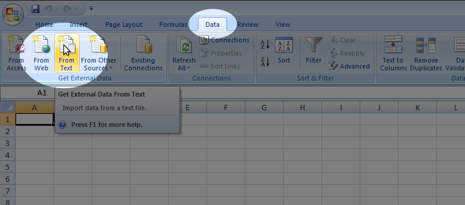
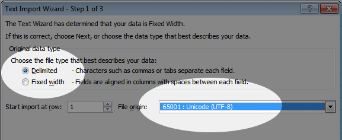

# Manuel d'import des fichiers CSV

Pour ouvrir un fichier `.csv` dans *Microsoft Excel*, il ne suffit en général pas de l'ouvrir, comme on pourrait le faire avec un autre tableur comme celui de *Libre Office* ou *OpenOffice.org*.
*Excel* sait pourtant bien comment ouvrir ce type de fichiers, mais il faut lui expliquer comment faire…

La première étape est de créer un fichier *Excel* vide.
Il faut ensuite lui demander d'importer des données depuis un fichier texte, comme sur la capture d'écran suivante :

Ensuite, il faut spécifier le format du fichier.
Pour nos fichiers `.csv`, il faut choisir un format à largeur de colonnes variable.
Le format d'encodage du texte doit quant à lui être `UTF-8`, comme sur la capture d'écran :

\clearpage

Et pour terminer, il faut indiquer que le séparateur de colonnes doit être la virgule :

